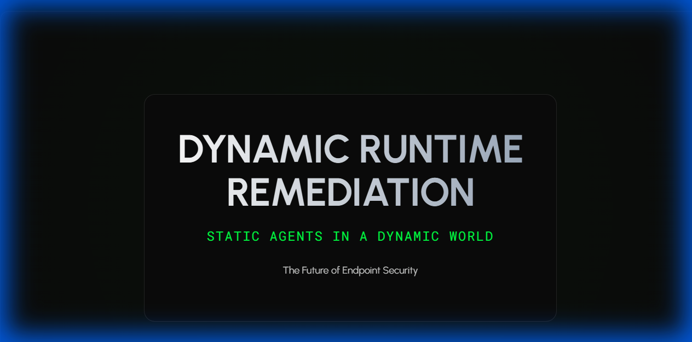

I build autonomous, self-healing infrastructure systems. My current focus is MagicPoint: a platform that integrates native Windows C# applications with Agentic Workflow to automate system reliability and security at the OS level.

---

### 🚀 Core Projects

* **[SystemMonitor](https://github.com/dparksports/SystemMonitor)**: A native Windows C# agent for autonomous system health. It monitors telemetry and uses Gemini Pro to diagnose and execute self-healing protocols locally.
* **[SecureFileMonitor](https://github.com/dparksports/SecureFileMonitor)**: A high-performance Windows security observer. It provides real-time file integrity monitoring and uses LLM-driven classification to identify and quarantine threats.

### 🛠 Technical Background

I specialize in the intersection of autonomous systems and high-stakes infrastructure.

* **Procore Technologies**: Principal AI Research Engineer.
* **Neo Cybernetica**: Autonomous AI Research Engineer.
* **Magic Leap**: AI Research Engineer.

### ⚡ Tech Stack

* **Languages**: C# (Native Windows), Python, C++
* **AI/ML**: Gemini Pro, Vertex AI, Autonomous Agent Architectures

---

### 🌐 Connect
* **Founder**: [Magic Point](https://magicpoint.ai)
* **Email**: contact@magicpoint.ai
* **Status**: Scaling Magic Point on Google Cloud / Claude / Open AI / Azure

---

### 📢 Presentations

* **[Dynamic Runtime Remediation](slides.html)**: A deep dive into the philosophy and architecture of our autonomous agents.
